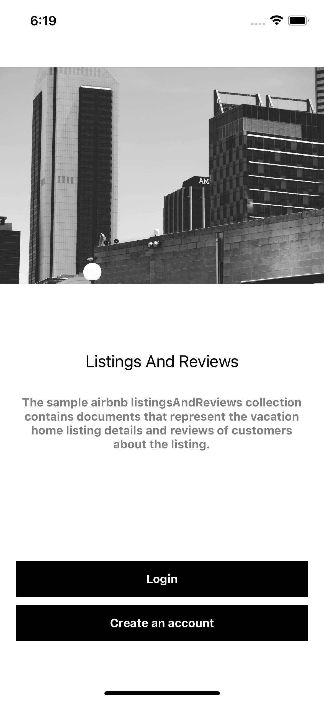

# AirBnB Listings and Review

### React Native, MongoDB realm, Typescript, Styled-Components and React Naviation V5

##### Setup node modules

```
npm install
```

##### Setup Pod files

```
cd ios

pod install
```

##### Compile and run

```
npm start
```

## About

React Native app built with MongoDB sample data sample_airbnb and realm, the app consist of :

1, allows user to authenticate through mongodb realm (register, signup, login).

2, if user is already registered, it automatically signs user in.

2, fetches data from mongoDB atlas through realm with sample_airbnb (free tier).

3, has an account page which shows the user's id and allows user to log out.

##### To add your own realm id

##### Note: you must enable sync, authentication and manage your data access rules within realm's dashboard and link it to your collections.

```
export function getRealmApp() {
  if (app === undefined) {
    const appId = '<App_ID>';//your app id
    const appConfig = {
      id: appId,
      timeout: 10000,
      app: {
        name: '<App_Name>',//your app name
        version: '0',
      },
    };
    app = new Realm.App(appConfig);
  }
  return app;
}

```



# MongodbRealm_sample_airbnb
